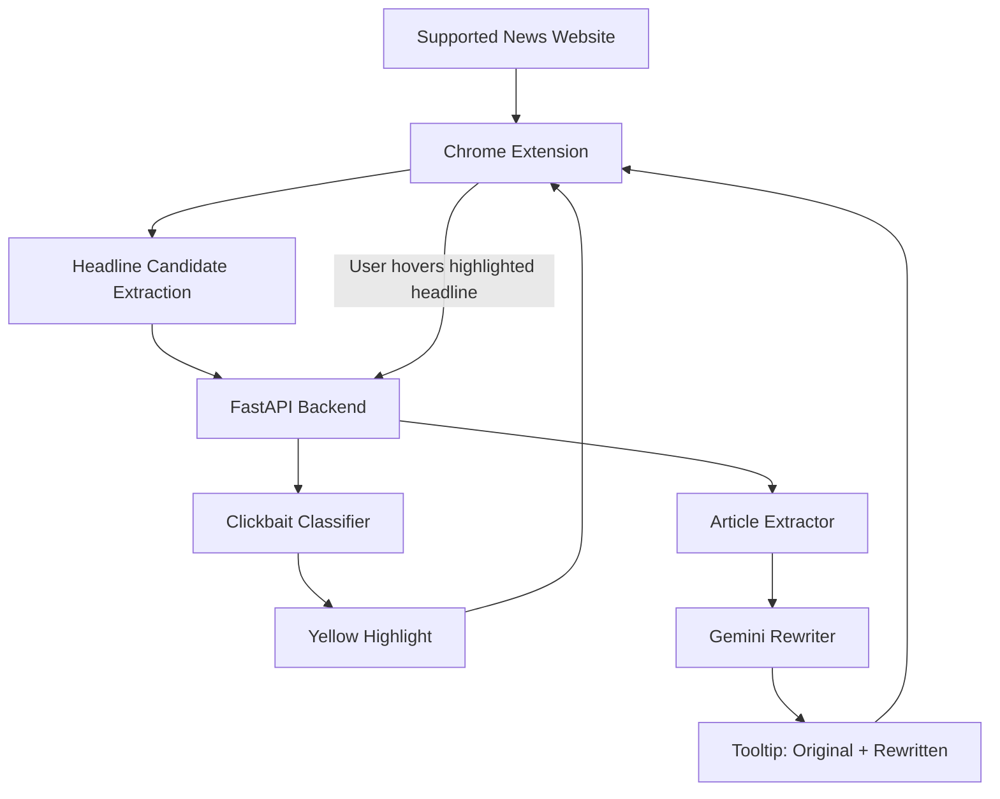

# Clickbait Rewriter

## Overview

Many news websites use headlines that hide key information, exaggerate emotion, or encourage users to click before understanding the main point. This project reduces that information gap by rewriting suspicious headlines with article-level context.

The system runs locally:

``` text
News website
→ Chrome Extension
→ FastAPI backend
→ headline classification
→ article extraction
→ Gemini rewrite
→ tooltip display
```

This version is a personal rebuild and extension of a junior-year undergraduate research project originally developed with teammates and supported by Taiwan's NSTC Undergraduate Research Project grant.

## Demo

### End-to-end workflow on Yahoo News Taiwan


### UDN headline highlighting


### ETtoday rewrite result


## Architecture



## Features

-   Support Yahoo News Taiwan, ETtoday, and UDN
-   Detects and highlights clickbait-style headlines on supported news websites
-   Extracts article content from the original news page
-   Rewrites headlines with Gemini using article-level context
-   Shows live processing status and rewritten results in a tooltip

## Tech Stack

### Frontend

-   Chrome Extension Manifest V3
-   JavaScript
-   CSS

### Backend

-   Python
-   FastAPI
-   Pydantic
-   Trafilatura
-   Readability
-   BeautifulSoup
-   Hugging Face Transformers
-   Google Gemini API

## Project Structure

``` text
clickbait-rewriter/
├── assets/
│   ├── demo_yahoo.gif
│   ├── ettoday_rewrite.png
│   └── udn_highlight.png
├── extension/
│   ├── manifest.json
│   ├── content.js
│   ├── background.js
│   └── style.css
├── backend/
│   ├── main.py
│   ├── config.py
│   ├── schemas.py
│   └── services/
│       ├── classifier.py
│       ├── article_extractor.py
│       └── rewriter.py
├── requirements.txt
├── .env.example
├── .gitignore
└── README.md
```

## Running the Project

### Install Dependencies

``` bash
python -m venv .venv
source .venv/bin/activate
pip install -r requirements.txt
```

### Configure Environment Variables

Create a local `.env` file:

``` bash
cp .env.example .env
```

Fill in the required values:

``` env
CLASSIFIER_MODE=model
CLASSIFIER_MODEL_NAME=Stremie/xlm-roberta-base-clickbait

GEMINI_API_KEY=your_api_key_here
GEMINI_MODEL_NAME=gemini-2.5-flash-lite

CLICKBAIT_THRESHOLD=0.7
MAX_CANDIDATES=100
MAX_REWRITES=5
```

### Start the Backend

``` bash
cd backend
uvicorn main:app --reload
```

Backend URLs:

``` text
http://127.0.0.1:8000/health
http://127.0.0.1:8000/docs
```

### Load the Chrome Extension

1.  Open `chrome://extensions/`
2.  Enable **Developer mode**
3.  Click **Load unpacked**
4.  Select the `extension/` folder
5.  Open a supported news website

## Usage

When a supported news page is opened, suspicious headlines are highlighted in yellow.

Hovering over a highlighted headline triggers article extraction and headline rewriting.

### Processing Status

The tooltip shows live status updates:

``` text
Extracting article...
Article extracted, xxxx chars. Rewriting...
Rewrite completed
```

If the pipeline fails, the tooltip shows a failure state:

``` text
Article extraction failed
Rewrite unavailable
```

### Rewrite Result

After rewriting succeeds, the tooltip shows:

``` text
Original:
<full original headline>

Rewritten:
<rewritten headline>
```

## API Overview

The FastAPI backend exposes four main endpoints:

``` text
GET  /health        # Check backend status
POST /api/classify  # Classify headline candidates
POST /api/extract   # Extract article content
POST /api/rewrite   # Rewrite headline with article context
```

Interactive API documentation is available at:

``` text
http://127.0.0.1:8000/docs
```

## Limitations

-   Article extraction quality depends on each website's HTML structure.
-   Gemini API quota may limit rewrite availability.
-   Gemini rewriting may take several seconds because the model receives article context.
-   Generated rewrites may still require prompt tuning for different news categories.
