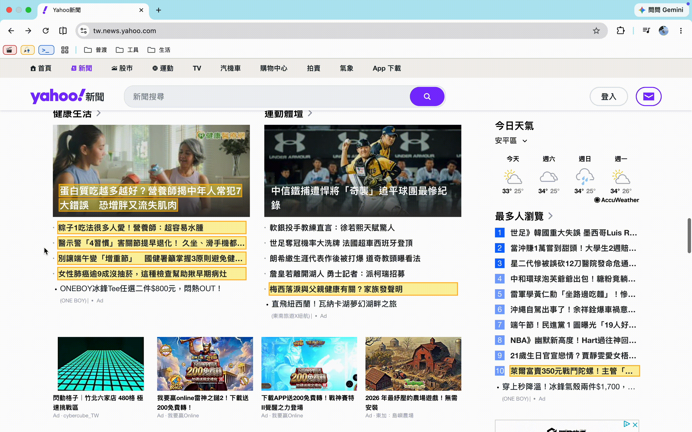
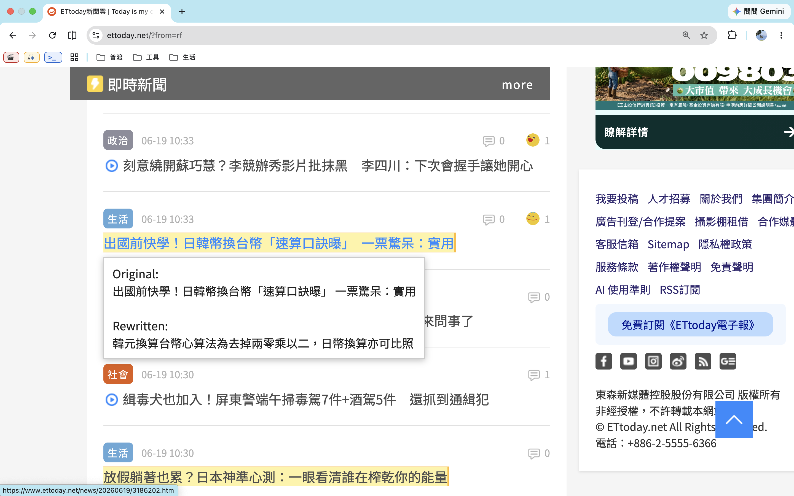

# Clickbait Rewriter

Clickbait Rewriter is a Chrome Extension with a FastAPI backend that detects clickbait-style headlines on Taiwanese news websites, extracts article content, and rewrites the headline into a clearer and more informative version using Gemini.

## 1. Overview

Many news websites use headlines that hide key information, exaggerate emotion, or encourage users to click before understanding the main point. This project reduces that information gap by rewriting suspicious headlines with article-level context.

The system runs locally:

```text
News website
→ Chrome Extension
→ FastAPI backend
→ headline classification
→ article extraction
→ Gemini rewrite
→ tooltip display
```

Rewriting is triggered on hover to reduce unnecessary Gemini API calls and avoid rewriting headlines the user never interacts with.

## 2. Demo

### End-to-end workflow on Yahoo News Taiwan



### Cross-site examples

ETtoday rewrite result:



UDN headline highlighting:


## 3. Features

### Browser Extension

- Detects headline candidates on supported news websites
- Highlights clickbait-style headlines directly on the page
- Shows live processing status in a tooltip
- Displays the full original headline and rewritten headline after processing

### Backend Pipeline

- Classifies headlines with a transformer-based clickbait classifier
- Extracts article content from the original news page
- Rewrites headlines with Gemini using article context
- Returns clear failure states when article extraction or rewriting is unavailable

## 4. Supported Websites

- Yahoo News Taiwan
- ETtoday
- UDN

## 5. Tech Stack

### Frontend

- Chrome Extension Manifest V3
- JavaScript
- CSS

### Backend

- Python
- FastAPI
- Pydantic
- Trafilatura
- Readability
- BeautifulSoup
- Hugging Face Transformers
- Google Gemini API

## 6. Project Structure

```text
clickbait-rewriter/
├── assets/
│   ├── demo_yahoo.gif
│   ├── ettoday_rewrite_result.png
│   └── udn_highlight.png
├── extension/
│   ├── manifest.json
│   ├── content.js
│   ├── background.js
│   └── style.css
├── backend/
│   ├── main.py
│   ├── config.py
│   ├── schemas.py
│   └── services/
│       ├── classifier.py
│       ├── article_extractor.py
│       └── rewriter.py
├── requirements.txt
├── .env.example
├── .gitignore
└── README.md
```

## 7. Setup

### 7.1 Install Dependencies

```bash
python -m venv .venv
source .venv/bin/activate
pip install -r requirements.txt
```

### 7.2 Configure Environment Variables

Create a local `.env` file:

```bash
cp .env.example .env
```

Fill in the required values:

```env
CLASSIFIER_MODE=model
CLASSIFIER_MODEL_NAME=Stremie/xlm-roberta-base-clickbait

GEMINI_API_KEY=your_api_key_here
GEMINI_MODEL_NAME=gemini-2.5-flash-lite

CLICKBAIT_THRESHOLD=0.7
MAX_CANDIDATES=100
MAX_REWRITES=5
```

## 8. Running the Project

### 8.1 Start the Backend

```bash
cd backend
uvicorn main:app --reload
```

Backend URLs:

```text
http://127.0.0.1:8000/health
http://127.0.0.1:8000/docs
```

### 8.2 Load the Chrome Extension

1. Open `chrome://extensions/`
2. Enable **Developer mode**
3. Click **Load unpacked**
4. Select the `extension/` folder
5. Open a supported news website

## 9. Usage

When a supported news page is opened, suspicious headlines are highlighted in yellow.

Hovering over a highlighted headline triggers article extraction and headline rewriting.

### Processing Status

The tooltip shows live status updates:

```text
Extracting article...
Article extracted, xxxx chars. Rewriting...
Rewrite completed
```

### Rewrite Result

After rewriting succeeds, the tooltip shows:

```text
Original:
<full original headline>

Rewritten:
<rewritten headline>
```

If extraction or rewriting fails, the tooltip displays a clear failure status instead of showing an unreliable fallback rewrite.

## 10. API Endpoints

### 10.1 Health Check

```http
GET /health
```

### 10.2 Classify Headlines

```http
POST /api/classify
```

### 10.3 Extract Article

```http
POST /api/extract
```

### 10.4 Rewrite Headline

```http
POST /api/rewrite
```

Request body:

```json
{
  "originalTitle": "Original clickbait headline",
  "articleText": "Extracted article text"
}
```

Successful response:

```json
{
  "status": "ok",
  "rewrite": {
    "originalTitle": "Original clickbait headline",
    "rewrittenTitle": "Neutral rewritten headline",
    "mode": "gemini",
    "error": null
  }
}
```

If Gemini is unavailable or quota is exceeded:

```json
{
  "status": "ok",
  "rewrite": {
    "originalTitle": "Original clickbait headline",
    "rewrittenTitle": "",
    "mode": "gemini_failed",
    "error": "..."
  }
}
```

## 11. Limitations

### External Dependencies

- Gemini API quota may limit rewrite availability.
- Article extraction quality depends on each website's HTML structure.

### Rewrite Quality

- Generated rewrites may still require prompt tuning for different news categories.
- The system avoids rule-based fallback rewriting because headline cleanup alone cannot recover information hidden by clickbait headlines.

### Performance

- Gemini rewriting may take several seconds because the model receives article context.
- Rewriting is triggered on hover to reduce API usage and latency for headlines the user does not inspect.

## 12. Current Status

Completed MVP:

```text
headline extraction
→ clickbait classification
→ browser highlight
→ article extraction
→ Gemini rewrite
→ tooltip result
```